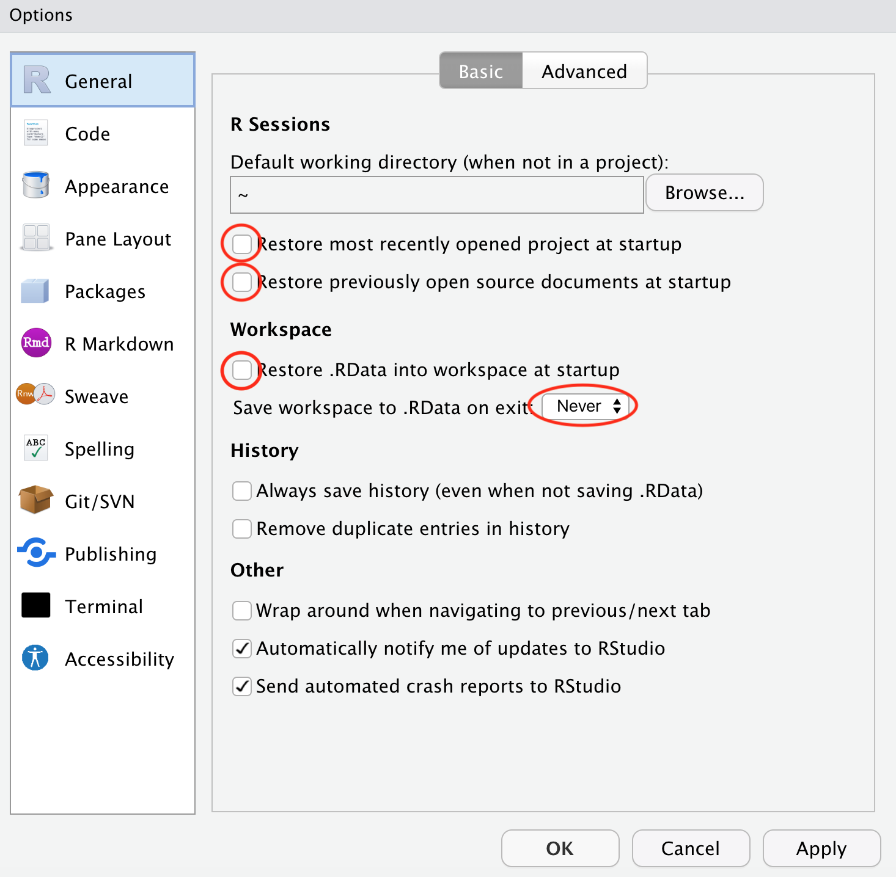
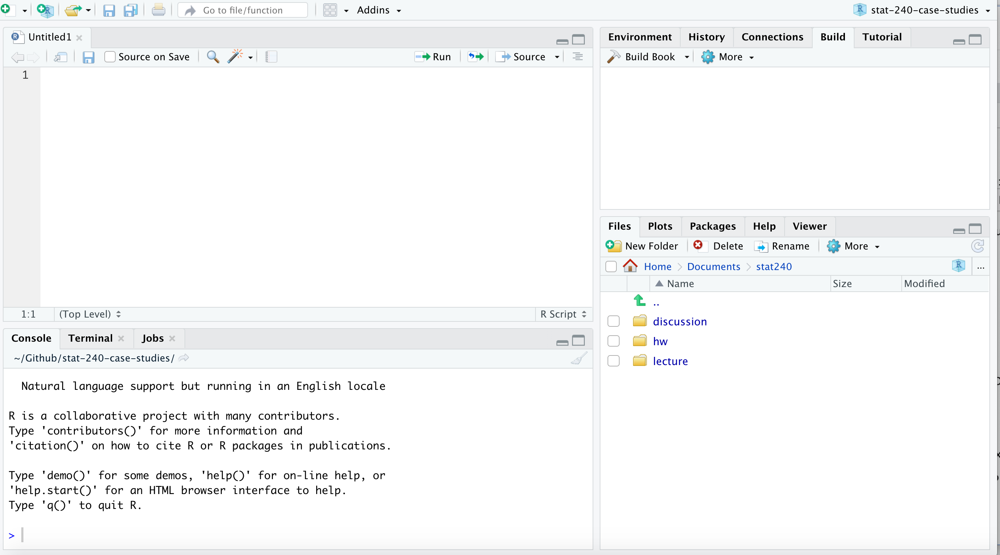

# Prerequisites

## Online Textbooks

The book *R for Data Science* (*R4DS*) is at https://r4ds.had.co.nz/ .
The first author of the book, Hadley Wickham,
is the primary author of the suite of R packages called the *tidyverse* that we will use extensively.

The book *Statistical Inference via Data Science: A ModernDive into R and the Tidyverse*, with the shortened title *Modern Dive* (*MD*),
is at https://moderndive.com/ .
This book covers many of the same *tidyverse* packages as *R4DS*,
but is written with students in an introductory course as the target audience, and so covers fewer of the *tidyverse* topics then *R4DS*, but with more details.
The book also introduces many topics in statistical inference and modeling that are not in *R4DS* but are part of the Statistics 240 curriculum.

Links to these textbooks are also available on the course website.

## R and R Studio

You need the R statistical software package and the R Studio Desktop tool,
an integrated development environment (IDE) for writing R code for the course.
R is a programming language, developed by statisticians,
that is very widely used for many data science applications.
R Studio is software we will use which contains all of the tools needed to write and edit files,
run R,
make graphs,
do data analysis,
write reports,
and render the reports into the HTML files you will need to upload for homework solutions, exams, and course projects.

### Installing R

The links below will take you to the textbooks for instructions on installing R and R Studio on your computer and brief introductions to the software.

- *MD* section 1.1.1
    - https://moderndive.com/1-getting-started.html#installing
- *R4DS* sections 1.4.1 and 1.4.2
    - https://r4ds.had.co.nz/introduction.html#r
    - https://r4ds.had.co.nz/introduction.html#rstudio
    
Here are more detailed instructions.

The latest version of R is at https://cran.r-project.org/.

1. Click on the link near the top of the page
to the version of the software for your operating system.
2. Install the latest version of R.
    - If you have a Mac, download the most recent binary with a name like `R.X.X.X.pkg`. (In August 2020, this is `R.4.0.2.pkg`.)
        - Double click the downloaded package and follow instructions.
        - Use the default directories for installation.
    - If you have Windows:
        - Click on base (or install R for the first time)
        - Click on Download R X.X.X for Windows (in August 2020, this is 4.0.2)
        - Double click the downloaded file and follow the instructions
    - If you have Linux:
        - you probably know how to do what needs doing on your own
        - ask me if you need help

Once you have R installed, you do not need to open it directly.
We will only interact with R through R Studio

### Installing R Studio

The latest version of R Studio is at https://www.rstudio.com/ .
As of August 2020, this is 1.3.1073.

1. A direct link to the download page is https://rstudio.com/products/rstudio/download/ .

2. Scroll down a little and click on the blue box that says **Download** below the RStudio Desktop / Open Source License / FREE text. Do not get RStudio Server or a commercial license for which you need to pay.

3. The browser should be smart enough to detect your computer and will take you to a page with a big blue button that says **Download R Studio for ___** with your operating system filling in the blank. Click on the link to download and follow instructions.
        
### Setting R Studio Defaults

While not strictly required,
I strongly suggest that you change preferences in RStudio to never save the workspace so you always open with a clean environment (which makes your work reproducible).

See section 8.1 of *R4DS* at https://r4ds.had.co.nz/workflow-projects.html#what-is-real for some more background.

1. Start R Studio
2. Open RStudio preferences

- On a Mac, click on the **RStudio** menu and select **Preferences...**
- On a Windows machine, go to the **Tools** menu and then select **Global Options**

3. Make sure the **General** button is highlighted from the left panel.

- **Uncheck** the three `Restore` boxes
    - Restore most recently opened project at startup
    - Restore previously open source documents at startup
    - Restore .RData into workspace at startup
- set `Save Workspace to .RData on exit` to **Never**
- Click **OK** to save the changes and close the preferences window.

The reason for making these changes is that it is preferable for reproducibility to start each R session with a clean environment. You can restore a previous environment either by rerunning code or by manually loading a previously saved session.

The R Studio environment is modified when you execute code from files or from the console. If you always start fresh, you do not need to be concerned about things not working because of something you typed in the console, but did not save in a file.

You only need to set these preferences once.

There are many other preferences you can adjust
as you learn more about RStudio and decide what to customize for yourself.

### R Studio Panels

There are four panels in the default RStudio environment.
Here is what this might look like after opening a clean RStudio session,
changing directories to your course directory,
and opening a new file to edit.

- Editor
    - The upperleft panel is used to edit files, such as R Markdown files.
    - You can also see a spread-sheet-like view of data in a data frame here.
    - There are tabs to switch among multiple files.
- Console
    - You can type and execute code here directly.
    - However, it is better for reproducibility to type code into a file and run the code from the file.
    - We will rarely use the console
        - The textbooks teach you R initially by having you type directly into the console and only later teach you about writing files.
        - We will try to instill this better practice from the start
- Environment/History/Other stuff
    - Environment shows data frames and other objects in the work space
    - I never use the History tab
- File manager/Plots/Packages
    - Use the Files tab to navigate your directories and find files to open
    - Plots will show up hereunder a different tab
    - Use the Packages tab to install packages

## Directories (Folders)

Computers are set up to store information in a hierarchical system of directories and files.
Another word for a directory is a folder,
as graphical user interfaces often represent a directory with the icon of a folder like you might place into a filing cabinet.

### The Home Directory

R Studio will designate one directory on your computer as the home directory.

- On a Mac, your home directory is something like what is below, replacing your actual account name in the obvious place.

> /Users/your-account-name/

- On a Windows machine, it is the Documents folder.

Within R Studio, this is simplified to just be called **Home**,
which you can see in the **Files** tab of the lower right panel.

### Course Folder

It is best practice to create a course folder somewhere on your computer.
Keep all files associated with this course in your course folder.
You should create subdirectories (folders inside of folders) for documents for different parts of the course.
For example,
you might want to create folders with the names `hw`, `discussion`, `data`, `handouts`, and `lecture` within your course folder.
Within your `hw` folder, you might want a different folder for each separate homework assignment.
Later in the semester,
you might want to add `exam` and `final-project` folders.

### Creating New Directories

You may certainly create new folders outside of R Studio,
but sometimes it is convenient to do so from within.
You do so with the **New Folder** button from the **Files** tab
in the lower right panel of the standard R Studio set up.

At this time, create a course directory.
You could do this directly from your Home directory,
but put it whereever is convenient for you.
Some students like current course folders on their desktop.
Others might have a Courses folder for all of their courses.

> Navigate to where you want your course folder to be, create it, and name it.
Do not use spaces in the name (get into good habits).
Then navigate into this folder and create some subfolders, perhaps named *data*, *hw*, *lecture*, and *discussion*.

### Paths

Each person's course directory will have a different path to it from `Home`.
I will refer to this as `COURSE`.
A path is represented as a series of directory names separated by forward slashes `/`.
(Windows actually uses back slashes, but use `/` inside of R and the computer will get it right. Your code will also then work from any operating system.)

If you have a folder named *discussion* in your course folder with a subfolder inside of it named *discussion-01*, the path to this folder is `COURSE/discussion/discussion-01`.

There are three other special symbols used in paths.

- The period `.` stands for the current directory.
- A double period `..` stands for the *parent* directory, one step up from the current directory.
- The tilde `~` is shorthand for the home directory. (Note that this is not a dash `-`. The tilde `~` is on your keyboard as the shift character above the single backtick `` ` ``, to the left of the `1` key.)

### The Working Directory

Each time you run R through R Studio, the R session is being run from one of the directories (or folders) on your computer. This directory is called the *working directory*. By default, your initial working directory is whatever your operating system considers to be home for you.
You will want to change this each session to a folder with all of the documents for a project.
For example, when working on your first discussion assignment,
you will want to navigate to a folder for this assignment and then set the working directory to that folder.
Under the `Session` menu, select `Set Working Directory` and then one of `To Source File Location` or `To Files Pane Location`.
If you have navigated in the files pane to the directory you want to use,
then make the latter choice.
If you have a file open for editing in the directory you want to make the working directory, then choose the former.

## Packages

There are many extensions to the R language which are distributed in *packages*.

In this course,
we will make extensive use of the *tidyverse* package,
which is actually a collection of many packages designed to work well together.
All packages are not part of the basic R installation
and need to be installed separately.
While packages may be installed from the command line,
I recommend using the *package manager* in R Studio.

### Installing Packages

Here are the steps to install *tidyverse*.

1. Open R Studio
2. Click the Packages tab in the lower right panel
3. Click the Install button
4. When the dialog box opens up, type tidyverse into the Packages text box
5. Make sure the Install Dependencies box is clicked (this is the default)
6. Click Install
7. Wait while a lot of text displays showing the status of the installation

You only need to install a package once.

If you want some more details than what I shared above, see one of the textbooks.

- *R4DS* 1.4.3, https://r4ds.had.co.nz/introduction.html#the-tidyverse if you want to install the *tidyverse* package from the command line in the console.
- *ND* section 1.3.1, https://moderndive.com/1-getting-started.html#package-installation, explains how to install packages using the package manager in R Studio.

### Compilation

Sometimes, during the installation of packages, a query will arise that asks if you want to compile a package from the source code.
You should answer **no**.

If you get errors when trying to install a package, reach out for help to a TA or instructor with the exact error message on Piazza.

## Browser Settings

In the course,
you will need to download a number of files of different types (R Markdown, PDF, CSV, HTML) from the Canvas course page and put them into specific folders.
Depending on your browser, you might need to change settings to allow this.
Some browsers will change downloaded text files by adding .txt (so that `01-discussion.Rmd` becomes `01-discussion.Rmd.txt`).
Some browsers will put all of your downloaded files into a Folder named Downloads without asking if you want the file somewhere different.
Some browers will automatically open a file with a program (such as using Numbers or Excel to open a .csv file).

We do not want any of these things to happen.

Here are things to check depending on which browser you are using.
(If your favorite browser is not mentioned and you have figured out how to change the settings, please let me know and I will add to these instructions.)

### Chrome

1. Open Chrome
2. Under the Chrome menu, select Preferences...
3. Scroll down and click the Advanced button
4. Scroll down to the Downloads section
5. Turn on the button "Ask where to save each file before downloading"

### Safari

1. Open Safari
2. Open Preferences
3. Click on the General tab
4. Change the "File download location" from "Downloads" to "ask for each download"
5. Unclick the box for "open safe files after download"

## Knitting a Document

In the class, you will learn to write documents with **R Markdown**.

- R Markdown is a variant of Markdown.
- An R Markdown document has the file extension `.Rmd`
- The file is plain text.
- There are some special symbols in the document that are interpreted to do things such as:
    - typesetting words in **bold** or *italics*,
    - making lists
    - making tables
- Intermingled with plain words are chunks of code which can be executed with the results appearing in the final document.
    - for example, you can have code to produce a graph in the R Markdown document which is replaced by a figure in the output

The process of turning an R Markdown document into another output format is called **knitting**.
In R Studio, knitting is as simple as pushing a button.
We will typically knit document to HTML, but knitting to PDF and Word are also possible.
In a typical assignment,
you start with a template R Markdown document, edit it,
knit to HTML, and upload the HTML document as the solution.
We often ask you to upload the .Rmd R Markdown file also so we can see your work.

When you have an R Markdown file open in the editor,
simply click on the **Knit** button to knit the document into another format.
Many R Markdown documents begin with a YAML section as a preamble (more on that later) which specifies the output.
You can also click on the little downward-pointing triangle to choose the output format.
But just clicking on Knit usually works to create HTML.

The new file will appear in the same directory as the source file and will have the same base name as the original R Markdown file, but will have a different extension at the end.
For example, knitting the file `01-discussion-basics.Rmd` will convert it to `01-discussion-basics.html`.
Knitting will also open the knitted file in a separate window.

## Uploading to Canvas

To upload an assignment in Canvas,
do the following steps.

1. Open Canvas
2. Click on the word Assignments from the left menu.
3. Find the corresponding assignment.
4. Click on the red Submit Assignment button.
5. Either enter text or upload files as instructed, and then click the red Submit button.
