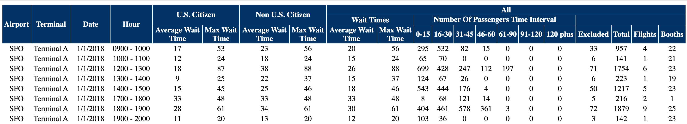

# Airport Waiting Times

```{r setup-05, include=FALSE}
knitr::opts_chunk$set(echo = TRUE,cache = TRUE,message=FALSE)
library(tidyverse)
library(lubridate)
```

## Customs at US Airports

United States Customs and Border Protection (CBP) is a federal agency tasked with the responsibility of protecting the nations borders from a variety of threats while facilitating legitimate international travel and trade.
The agency employs over 60,000 people, many of whom are law enforcement agents at points of entry to the United States, including at US Airports.

When travelers arrive at a US airport after an international flight, they must first clear customs before continuing their travel.
Typically, as passengers disembark from an airplane, they walk some distance before entering a passport control area.
Here, holders of US passports are separated from those traveling with passports from other countries and each group waits in a line until they meet with a border control agent.
Many airports have express lanes or kiosks for those in the Global Entry program and for flight crew.
Others wait in line to see a CBP agent.

After passport control passengers need to obtain their luggage,
and if connecting to a domestic flight, again pass through security before moving to their next gate, all of which takes time.
The CBP measures the time it takes for passengers to clear the passport control area and shares this information with the public for assistance in planning.
The times recorded to not include the time to disembark the plane, walk to the passport control area,
or to retrieve luggage, clear security, and navigate the airport to the gate of a connecting flight.

> CBP closely monitors the flight processing times, commonly referred to as wait times, for arriving flights at the busiest international airports. The data provided in this report will show the number of passengers processed on flights arriving in each hour based on how long it took for those passengers to clear Passport Control.

> Flight arrival patterns can vary considerably by time of year and day of week, as well as by time of day. To help travelers in planning their next flight, CBP is providing the public with historical data for the wait times at the busiest international airports that can be used to estimate possible wait times by airport and arrival terminal.

## My Travel Experience

In June of 2018, I arrived at San Francisco's international airport (SFO) after a long flight from Sydney, Australia, about two hours before the scheduled departure of my connecting flight. As I travel internationally very infrequently, I had not joined the Global Entry program. (The program has a nonrefundable $100 fee and requires an interview which may take some time to schedule. Prior to my travel, I thought that the program required annual renewal, but the renewal period, I just recently discovered, is actually five years.)
Needless to say,
there were hundreds and hundreds of people ahead of me in line when I entered the passport control area. I could not see what was happening on the side of the room with international passport holders, but on the side with US passport holders, there were two booths that were serving flight crew and Global Entry members and a single booth for the rest of us.
The two booths for Global Entry had some activity, but the agents there sat idle for most for most of the time I observed.
Meanwhile, the single booth on our side was processing travelers slowly.
Eventually, they opened a couple more booths and the pace picked up,
but it was minutes before my scheduled departure time when I finally got through passport control and I had no chance to collect my luggage, go through security, and walk to the gate of my now rescheduled flight for a seven-hour wait.
(I did make it home later that day, even though that flight was cancelled for mechanical reasons, but a replacement plane got me to Denver just in time to make the final flight to Madison, arriving home 33 hours after I had begin my travel.)

While sitting at SFO, I had the time to use my phone to search the internet to see if there was data about waiting times at airports, and discovered to my surprise, that there was.
So, while the travel was frustrating (did I mention the entertainment system failed one hour into the 14-hour flight across the Pacific), I did gain the inspiration for this case study.
Was my experience at SFO typical or just unlucky?
Are there some times of day, days of the week, months in the year, when time to clear passport control is less?
Are other airports more efficient than SFO?
Does CBP purposely understaff regular booths so that more frustrated travelers decide to pay the $100 fee to join Global Entry?
We have the data to address these questions! (Well, maybe not that last one.)

## Airport Wait Times

The CBP maintains a website, https://awt.cbp.gov/,
where one can create a report of airport wait times at many large US international airports.
The data is displayed in an HTML table for the time period requested.
The data is easy enough to read if your aim is to scroll through by eye to check wait times for a few dates or times of day, but is not in the simple comma-separated-variable format we have seen so far.
In addition to being in HTML,
there is a complicated header where some columns have single names but others have multi-line headers.
We will need a new tool to read in this data.



There are 21 variables in HTML table, and the format is the same across each airport, so this will make combining data from multiple airports simpler.
Here is a quick summary of the data in each column.

| Column | Description |
|:---:|:-------------------------------|
| 1 | 3-letter Airport code |
| 2 | Terminal |
| 3 | Date |
| 4 | Hour |
| 5 | Average wait time for US citizens |
| 6 | Maximum wait time for US citizens |
| 7 | Average wait time for non US citizens |
| 8 | Maximum wait time for non US citizens |
| 9 | Average wait time for all passengers |
| 10 | Maximum wait time for all passengers |
| 11 | # of all passengers who wait 0-15 minutes |
| 12 | # of all passengers who wait 16-30 minutes |
| 13 | # of all passengers who wait 31-45 minutes |
| 14 | # of all passengers who wait 46-60 minutes |
| 15 | # of all passengers who wait 61-90 minutes |
| 16 | # of all passengers who wait 91-120 minutes |
| 17 | # of all passengers who wait more than 120 minutes |
| 18 | passengers excluded from the wait time summaries |
| 19 | total number of passengers |
| 20 | # of international flight arrivals |
| 21 | # of booths open |

Each row contains data from a single hour.
There are no rows if there were no arrivals during the hour.
Most of the columns are self-explanatory, but some require some interpretation.

- I assume that waiting times begin when an individual starts waiting in line at passport control and ends after they have seen an agent.
- I assume that flights are counted during the hour they arrive at the gate.
- I assume passengers are counted during the hour they arrive at the passport control area, which might be the hour after their flight arrives depending on how close the arrival time is to the end of the hour and how long the plane disembarkation process takes.
- Average and maximum waiting times are in minutes.
- Excluded counts are part of the total number of passengers, but are not part of the wait time counts.
- Booths may not be open for the entire hour in which they are listed
- I assume the data is mostly accurate
    - But there were *not* 20 booths open during the 6-7am hour when I started to wait at SFO, Terminal G, on June 11, 2018!
    - ... unless you count the booths that had someone present for part of the time, but not actually serving any passengers.

For this case study, we will examine airport wait times from six of the busiest US international airports for all days of 2018.
Interested students can download data from different years or different airports for their own exploration.

## Questions

1. Are some airports more efficient that than others in terms of average time?

2. Are some months busier than others?

3. Are some days of the week busier than others?

4. Are some times during the day busier than others?

5. How does the proportion of people who get through customs in less than 30 minutes depend on other factors?

6. How does the proportion of people who take more than an hour to clear customs depend on other people?

7. Are some airports more efficient in the number of people served by hour per available booth?

8. Are there differences between domestic and international passengers in the mean time to go through customs?
