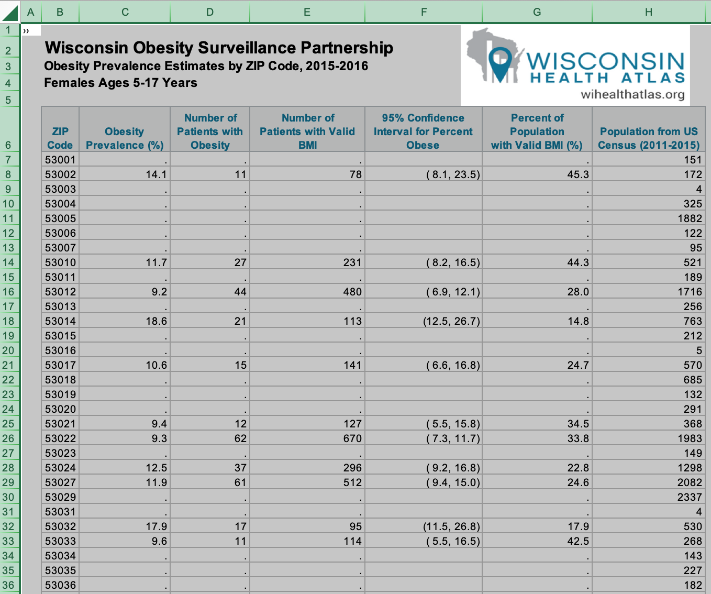

# Wisconsin Obesity

```{r setup, include=FALSE}
knitr::opts_chunk$set(echo = TRUE,cache=TRUE,message=FALSE)
library(tidyverse)
library(lubridate)
library(readxl)
```

## Obesity

Obesity is one of the leading factors of negative health outcomes in the country and it is especially prevalent in Wisconsin.
On average, obese people have higher rates of cancer, diabetes, heart disease,
and live shorter lives than people with normal weights for their height.
In a study from the mid 2010s,
health researchers in Wisconsin who study obesity examined potential explanatory factors.
These researchers released to the public obesity data based on actual measurements at doctor's offices across the state, rather than self-reported measurements,
a first in the nation.
Data is aggregated by zip code.
The US Census Bureau also collects and shares data on many demographic variables at the zip code level.
This will allow us to examine relationships between obesity and possible predictors such as household income, education level, and the rural/urban character of a zipcode.

### Obesity Definitions

For adults, obesity is defined as having a body mass index (BMI) greater than or equal to 30,
where the BMI is the mass in kg divided by the square of the height in meters.
For children (aged 5--17 in the data set),
obsesity is based on their BMI being above the 95th percentile for their sex and age in months based on the 2000 CDC growth curves.
See \url{https://www.cdc.gov/obesity/} for more information.
Note that this difference in the definition of obesity between adults and children needs to be taken into account when making comparisons and making inferences.

### Obesity Data

The Wisconsin obesity data is distributed by the Wisconsin Health Atlas organization:  \url{https://www.wihealthatlas.org/obesity/download/}.
Data is distributed in Excel workbooks with different sheets for different age cohorts.
We will use two workbooks, one for males and one for females.
There are seven variables in each sheet,
but we will use only information from four of these:

- ZIP code
- number of obese subjects
- number of subjects
- estimated population

Other columns are computed based on these values.
For example, the obesity prevalence is the number of obese subjects divided by the number of subjects times 100 percent and the percent of the population with a valid BMI is the number of subjects over the estimated population times 100 percent.

Population estimates are based on the American Community Survey (ACS) of 2015
and obesity data is based on routine medical visits throughout Wisconsin
over a period of time spanning 2015--2016.
To protect confidentiality,
data is unreported for any subgroup where the sample size is less than 10% of the population for an age/sex cohort within a zip code,
if the numerator is less than 10 or the denominator less than 30,
or if the estimated relative standard error is higher than a threshhold.
Hence there is considerable missing data in among the 774 zip codes for some age/sex cohorts.

### Obesity Variables in Excel



The image above shows part of the data and will illustrate issues in importing and analyzing the data.
The data is in two Excel Workbooks, one for females and one for males.
Each workbook has seven sheets.
There is no data in the first two sheets.
Each of the next five sheets contains data for a single age group.
As you can see in the image,
there are features of this data that require attention.

- The first five rows do not contain data.
- The sixth row is a header with variables names, but the names are not suitable for internal analysis.
- Missing data is represented by a period `.` in a cell. There is substantial missing data.

In our analysis, we will work directly with the raw counts and ignore the calculated values which are rounded.
In the example above, row 8 contains data from girls aged 5-17 in the 53002 zip code.
There are a total of 172 such girls in this age group living in this zip code at the time of the study.
Among these 172 girls, BMI measurements were taken for 78 of the 172 girls.
Of these 78, 11 were categorized as obese.
The estimated obesity rate in the 53002 zip code for girls aged 5-17 is 11/78, or about 14.1%.
By extending this sample proportion to the population,
the estimated number of girls in the population of 172 whom are obese is 172*11/78, or about 24, with an estimate of 172 - 24 = 148 girls who are not obese.

Most of our calculations with this data will be using these estimated population totals of the numbers of obese and non obese individuals in a given zip code/age/sex cohort.
A more advanced analysis would also incorporate the sampling variation.
Furthermore, the analysis will be affected by the many zip codes where obesity data is missing.
We will need to keep this in mind when aggregating data across zip codes to the state level.
While it would be possible to impute missing data using information from similar zip codes with complete data and data for other age groups within the same zip code, we will not do so at this level of analysis.

## Census Data

The United States Census Bureau collects and releases demographic data by zip code.
We will extract information from three such data sets,
one with household income data,
one with educational attainment data,
and one with urban/rural data.
The income and education data is collected by the United States Census Bureau through the ACS and can be downloaded through the American Fact Finder search engine: \url{https://factfinder.census.gov/}.
Each of these data sets is in a CSV file with one row per zip code
and a large number of columns.
These files are summaries of data collected in the 2017 ACS,
so there will be minor differences in population estimates.

By examining these data sets together,
we will seek associations between demographic variables and obesity
in Wisconsin.

## Files

- Obesity+Prevalence+by+ZIP+Code+and+Age+Group,+Females.xlsx
- Obesity+Prevalence+by+ZIP+Code+and+Age+Group,+Males.xlsx
- wi_education.csv
- wi_income.csv
- wi_urban_rural.csv

The Excel workbooks each have multiple sheets.
You will need to use **read_excel()** from the **readxl** package
to specify sheets and ranges of data to read.

The CSV files have many columns we will not need to use, so you will need to use the functions **select()** and **rename()** from **dplyr** to manage this data.

You will need to learn to use other functions from the **dplyr** and **tidyr** packages in order to join together these different data sets into a single comprehensive data set for the analysis to answer the following questions.

## General Questions

1. What overall percentage of Wisconsin residents are obese?
Among males and females?
Among adults and children?
By age group?
Calculate the obesity percentage separately for males and females for each age range given.

2. What fraction of Wisconsin residents live in rural and urban areas?
How does this vary by sex?
By age?
What assumptions do we need to make for these calculations?

3. Examine the relationship between obesity and rural/urban percentage.
Make a scatter plot with one point for each zip code.

4. Calculate the obesity rate for adults who live in rural areas and in urban areas. What assumptions do we need to make for these calculations?

5. Create a graph that shows the distribution of median household incomes by zip code in the state of Wisconsin.

6. Examine the relationship between obesity and median household income.
Make a scatter plot with one point for each zip code.

7. Calculate the percentage of adults aged 25 and older with a bachelors degree overall and separately for men and women.

8. Examine the relationship between obesity and education level.
For each education category,
calculate the obesity rate overall, and separately for men and women.
Display this data with an appropriate bar chart.

