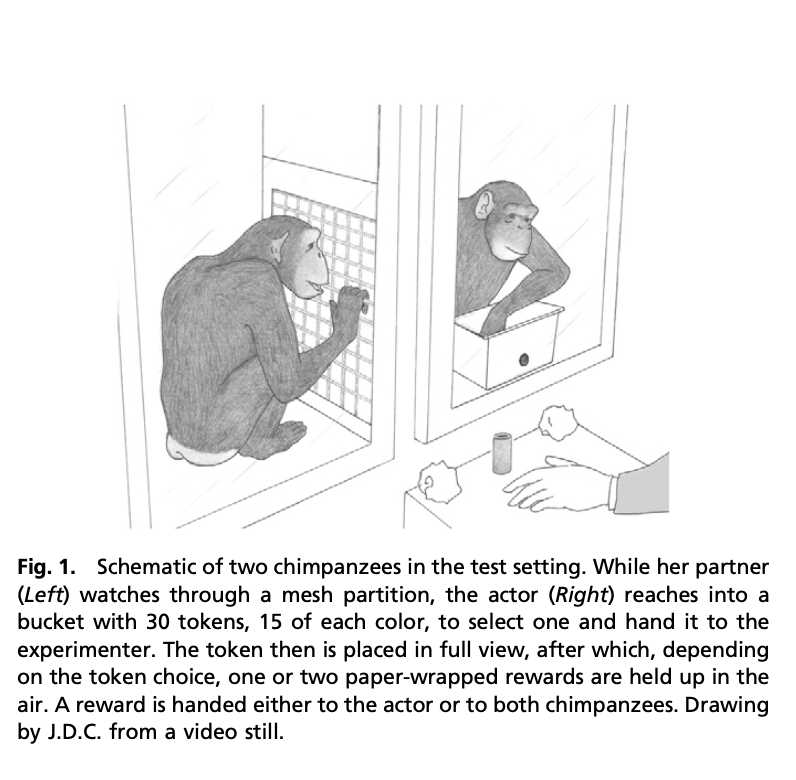

# Chimpanzees and Prosocial Choice

```{r setup-8, include=FALSE}
knitr::opts_chunk$set(echo = TRUE,cache=TRUE,message=FALSE)
library(tidyverse)
```

## Prosocial Choice Experiments

A question that has long interested scientists is the following: why do individuals sometimes behave in altruistic ways? There are many examples in everyday human life.
Emergency responders who rush into dangerous situations to help people in need.
People who give food, clothing, or school supplies to others who are hungry, poorly clothed, or in need of materials to learn.
Not all prosocial behavior is altruistic (the giver expects nothing in return).
In many instances, the giver expects to gain something in return at some later time.
But regardless of the motivation,
humans, as a species exhibit prosocial behavior frequently.

An interesting question then is, do individual in other intelligent species also exhibit prosocial choice behaviors? In a natural settings, we may observe animals sharing food with others or grooming a mate, but this behavior is most often observed in parents caring for their offspring, or partners caring for one another. What about prosocial behavior in an experimental setting where the individual making the prosocial choice has nothing to gain?

Several years ago,
a group of scientists who study primate behavior
at the Yerkes National Primate Research Center at Emory University in Atlanta, Georgia
conducted an experiment with the aim of demonstrating prosocial choice behavior among chimpanzees, the most closely related living species to humans.
In the experiment,
chimpanzees were given a sequence of trials where they could make a prosocial or a selfish choice.
The scientists aimed to show that chimpanzees made the prosocial choice more often than chance could explain.

## Experiment Description

The experiment involved chimpanzees who lived in a common social group at the research center and was conducted in a series of sessions over many days.
In each session,
one chimpanzee, whom we will call the actor, was placed in a small enclosure.
Another chimpanzee, designated the partner, sat in a neighboring enclosure.
A sketch of the experimental layout is shown below.



During a session, the actor was presented with a bucket filled with plastic tokens of two colors.
Prior to the session,
the researchers designated one color the *prosocial* color and another the *selfish* color.
The actor removed a plastic token from the bucket and passed it to the researcher.
If the token was the prosocial color, the researcher would hand a treat to both the actor and the partner.
If the token was the selfish color,
the researcher only gave a treat to the actor and took the other treat away.
The treats were wrapped in paper which made a loud crinkly sound when being opened,
and the partner could observe what was happening.

In an initial training set of trials at the start of the session,
the actor had a bucket of ten tokens, five of the prosocial color and five of the selfish color.
When selecting these tokens,
the food was distributed according to the protocol so that the actor could observe and learn from the results of each choice.
After these tokens were selected,
the bucket was refilled with 30 tokens, 15 of each of the two colors.
The choices made by the actor for the next 30 tokens were recorded.
However, for these trials, the token was replaced after each selection by the actor so that the actor was always making a selection from a bucket with equal numbers of tokens of each color.

There were seven different chimpanzees who served as actors over the course of the study. These seven and a few others were partners for other sessions.
The experiment was planned so that each of the seven chimpanzees would be the actor for three sessions, each time with a different partner, and after the training stage, would have choices recorded for 30 trials.

## Controls

The researchers instituted a number of controls.
There were three different color combinations and each actor used a different set for each of the three sessions.
Randomization helped to determine which color would be the selfish and which would be the prosocial color for a given session.
Furthermore, it was planned for each actor to do a session with no partner present.
In these sessions without a partner,
the researcher still mimicked handing a food treat to the empty partner enclosure when the actor selected the prosocial color.

## Behavior

Another aspect of the experiment was that behavior of the partner was observed and categorized during each selection made by the actor in order to study if this behavior affected the actor's choices. We will not examine this aspect of the experiment.

## Data

The data in the file *chimpanzee.csv* is artificial,
but selected to be consistent with the results and graphs in the published paper.
There are a few anomalies between the data and the design.
One of the chimpanzees died of natural causes without doing the no-partner control session,
so there are only six such sessions.
There are a few instances where a session was cut short before the intended 30 trials were complete.
The paper is not explicit about this,
but to match the published test statistics, data summaries, and p-values, such differences in the actual sample sizes from what was planned is necessary.

## Statistical Models

A purely descriptive analysis of the data from this experiment might have us simply make graphical and numerical comparison of summary statistics about the relative frequency that the chimpanzees made the prosocial and selfish choices under different conditions.
However,
with this data set from a designed experiment,
we plan to introduce some fundamental concepts about statistical modeling and statistical inference.
The concepts are all built upon a mathematical structure of probability where we consider not only the data measured from what occurred, but what the data might have been if chance had behaved differently,
or if the experiment were to be repeated.

The experiment may be modeled as a sequence of trials,
indexed by an index variable $i$ which ranges from 1 to some $n$,
each of which resulted in a choice made by the acting chimpanzee of selecting either the prosocial or selfish token.
We model the probability that the chimpanzee who was the actor for trial $i$ making the prosocial choice with a probability $p_i$.
The observed response variable we might designate $y_i$ which takes the value 1 if the prosocial choice is made and 0 in the selfish case.
There are a number of other variables we might consider for each trial:
the identity of the actor; if a partner was present; the identity of the partner if present;
the colors of the prosocial and selfish tokens; the order in time among all trials from the same session; the behavior of the partner prior to the selection being made; the date or time of day; the result of the previous trial.

In practice, in any single analysis, we will ignore most of these other potentially interesting variables.
There are multiple reasons for this.
Some of the data is not available.
The published paper only provides summary information that does not specify the results in order, nor the identities of the partners for each session, nor the colors of the tokens used in each session.
Some of this is depicted in the artifical data set, but some is not.
Furthermore,
a statistical model is always a simplification of reality.
There is a delicate balance between model simplicity, which risks omiting important factors and possibly leading to model bias an misleading conclusions,
versus model complexity which may more closely match reality, but be subject to insufficient data with results affected random data fluctuations more so than underlying causal factors of interest.

## Assumptions

Any statistical model will be based upon a number of assumptions.
Here are several possible assumptions to consider for different parts of an analysis.

1. All trials are independent of one another (results from one provide no information about other results).

2. There is a fixed prosocial choice probability $p$ which has the same value for all trials from 1 to $n$.

3. There is a single prosocial choice probability for all trials when a partner is present, regardless of the identities of the actor and the partner.

4. Each actor has her own prosocial probability which is the same for all of her trials when a partner is present.

5. The prosocial choice probability is equal to 0.5; either always, or only in the cases where there is no partner.

There are many more assumptions we might make.
It will be important when doing calculations for statistical inference to be clear to the reader (and to ourselves) which assumptions we are making.

## Probability Preview

Before moving on to an analysis involving statistical inference,
it is necessary to first delve into the world of probability.
Our study of probability will begin with a case motivated by this experiment:
a sequence of trials, each of which has two possible outcomes,
where we assume that the same probability of one of the outcomes for each trial.
But we will soon thereafter expand to more general models for data from this and other studies.

## Questions

1. Is there evidence that chimpanzees exhibit prosocial choice behavior in these experimental settings?

2. Does the prosocial choice probability depend on the presence of a partner?

3. Do all chimpanzees have the same prosocial choice probability in the presence of a partner, or do these probabilities vary among chimpanzees?

4. Is the prosocial choice probability equal to 0.5 when there is no partner present?

5. Is the prosocial choice probability greater than 0.5 when there is a partner present?

6. Can we estimate the prosocial choice probability of a chimpanzee in this setting and put confidence limits around this estimate?

7. Does the prosocial choice probability of a chimpanzee vary from session to session?

8. Does the prosocial choice probability of a chimpanzee vary within a session?

9. Are the choices made in different trials within the same session independent of one another?
