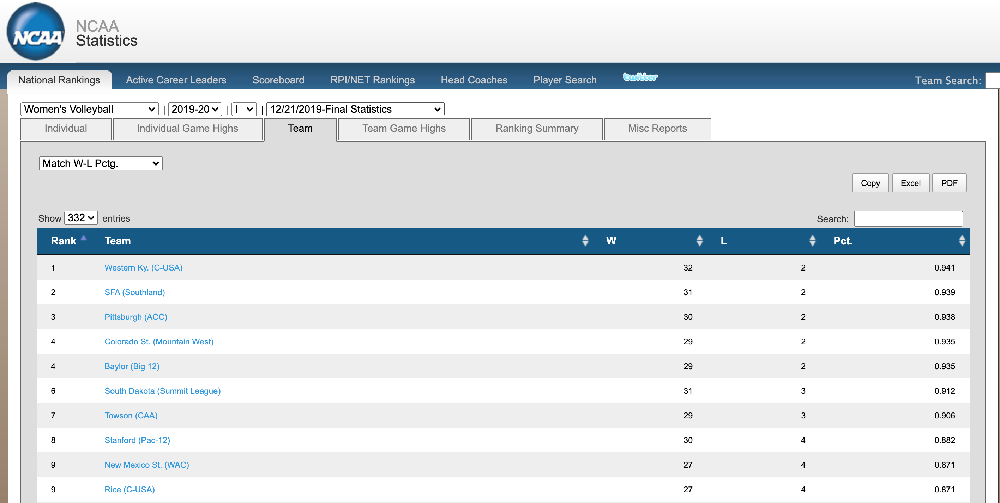
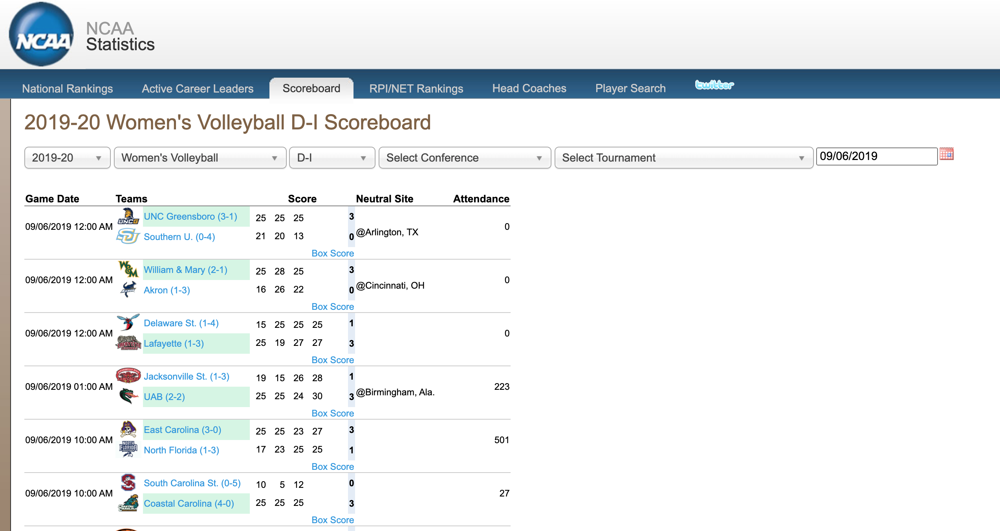

# Volleyball

\newcommand{\given}{\,\mid\,}
\newcommand{\E}{\mathsf{E}}
\newcommand{\Var}{\mathsf{Var}}
\renewcommand{\prob}{\mathsf{P}}
\newcommand{\me}{\mathrm{e}}

```{r setup-16, include=FALSE}
knitr::opts_chunk$set(echo = TRUE, message=FALSE)
library(tidyverse)
library(lubridate)
library(kableExtra)
source("scripts/viridis.R")
source("scripts/ggprob.R")
```

## UW Women's Volleyball

The University of Wisconsin---Madison has a highly successful women's volleyball team.
The team has won the Big 10 title six times, most recently during the 2019 season.
While they have never won a national championship, they have excelled in the post season and have been national runner-ups twice.

## Volleyball Basics

In collegiate volleyball, teams play a series of sets.
The first team to win three sets wins the match.
The first four sets (the fourth played only if necessary) are played to 25 points,
but the winner needs to win by two.
Hence, if the score is tied 24-24,
then a team will need more than 25 points to win the set.
The fifth set is only played until 15 points,
but also must be won by two points.
The score of a match is the number of sets each team wins,
and will be one of 3-0, 3-1, or 3-2.

During a set,
for each point, one team serves the ball and the other team receives.
If the serving teams wins the point,
they continue serving.
If the receiving team wins the point,
they get to serve the next point.
There are many rules about rotations,
positions, legal ways to hit the ball, and so on that are unimportant for our analysis.

### Volleyball Competition

The 332 division I teams are partitioned into 32 conferences.
Wisconsin is one of 14 teams in the Big 10 conference (at some point in the past, there were only ten Big 10 teams, which explains the name).
Teams in the same conference play many matches against one another,
but also compete in non-conference matches against other teams.
The winner of each conference qualifies for the 64-team NCAA tournament
as do several other good teams selected by a committee.
The tournament is a single-elimination competition
where the top 16 teams are seeded and all 64 teams placed into a large bracket.
Teams are paired in each round with winners advancing until a champion is determined.

## 2019 Season Data

In our analysis,
we will examine two different data sets,
each from the 332 NCAA Division I women's volleyball teams.
(NCAA is the National Collegiate Athletic Association which administers US collegiate athletic competitions.)
One data set has team statistics for each of the teams.
This data is in the file *volleyball-team-2019.csv*.
The second data set contains results from almost every match played between two division I teams, either in the regular season or during a conference tournament,
and is in the file *vb-division1-2019-all-matches-updated.csv*.
(There are additional volleyball divisions which are less competitive.
We eliminate matches between division I teams and teams from other divisions.)

### Volleyball Team Season Statistics

Here is a summary of match statistics for each team and descriptions.
Note that most of the statistics which are total counts
will be more meaningful if they are translated into counts per set.
For example, the variables `Kills` is the total number of kills a team recorded during the season.
Teams with high numbers of kills are good, because these teams score points when they spike the ball into the opponents court.
But very good teams may play a smaller number of sets per match than average teams
if the very good teams sweep their opponents often and win many matches in three sets
where an average team may have more matches that go four or five sets,
resulting in larger total counts.

```{r, echo = FALSE }
vb = read_csv("data/volleyball-team-2019.csv")

vb_stats = tibble(
  statistic = names(vb),
  description = c(
    "The name of the college or university",
    "The name of the conference",
    "Number of wins",
    "Number of losses",
    "Winning percentate",
    "Number of sets played",
    "Number of aces (winning a point directly off of a serve)",
    "Number of assists (passing a ball to a teammate who then wins the point)",
    "Number of individual blocks (blocking the ball at the net)",
    "Number of blocks with two or more defenders",
    "Playing a ball after an attack to prevent it from hitting the floor",
    "Hitting a ball, directly leading to a point",
    "Hitting a ball out of play",
    "Hitting a ball to the other side",
    "(Kills - Errors)/(Total Attack)",
    "Kills by the opponent",
    "Errors by the opponent",
    "Attacks by the opponent",
    "Opponent hitting percentage"))

kable(vb_stats) %>% 
  kable_styling(bootstrap_options = c("striped","condensed"),
                position = "left", full_width = FALSE)
```

### 2019 Division I Match Statistics

The second data set has a single row
for each 2019 women's volleyball match played prior to the start of the NCAA tournament where both teams were in the NCAA Division I.
There were nearly 5000 such matches.
A simple summary of a match lists the points that each team scored in each set.
If a match lasts only three or four sets,
there will be missing data in sets that did not get played.

Most volleyball matches occurred at one school's home court.
For these matches,
the site is missing (`NA`)
and the second team is the home team.
The matches that list a site are played at a neutral court.
The following table has more detailed descriptions of the variables.

```{r, echo = FALSE}
vb_matches = read_csv("data/vb-division1-2019-all-matches.csv")

match_stats = tibble(
  name = names(vb_matches),
  description = c(
    "the date",
    "team 1",
    "team 2",
    "location of the match if at a neutral site (team 2 is the home team when missing)",
    "team 1 set 1 score",
    "team 1 set 2 score",
    "team 1 set 3 score",
    "team 1 set 4 score",
    "team 1 set 5 score",
    "number of sets won by team 1",
    "team 2 set 1 score",
    "team 2 set 2 score",
    "team 2 set 3 score",
    "team 2 set 4 score",
    "team 2 set 5 score",
    "number of sets won by team 2",
    "name of winning team",
    "name of losing team",
    "number of people in attendance"))

match_stats %>% 
  kable() %>% 
  kable_styling(bootstrap_options = c("striped","condensed"),
                position = "left", full_width = FALSE)
```

### Volleyball Data Source

Both data sets were obtained from the NCAA statistics portal, [stats.ncaa.org](http://stats.ncaa.org).
This web site has statistics for multiple NCAA sports for multiple seasons.
The team statistics were obtained by navigating to season final statistics,
downloading a separate data set for each summary statistic,
and then transforming and joining the data.
A screen shot of the web site looks like this.



The match statistics were acquired by scraping the site with code from the **rvest** package and then using additional specialized functions to extract the match scores from the raw html.
HTML was acquired for each date of the year with one or more matches.
Partial data from a single date looks like this.



There are a number of errors in this data.
Approximately 50 of the matches have posted set scores that are impossible,
such as the winning set score being greater than 25 but not exactly two points higher than the opponent score that set,
or a winning score in one of the first four sets having fewer than 25 points.
We made a number of automatic adjustments to correct these errors.
There are an additional number of errors where the posted set scores do not match the values from other sources of information.
These are more difficult to detect and correct.
It is likely that the error rate is just over one percent
and most errors involve relatively minor adjustments to the points scored by each team
in places where there are errors.
These discrepancies will have minimal effect on our subsequent analyses.

## Volleyball Questions

There are a number of questions we might ask.
In particular,
we will be interested in finding variables that might predict the winning percentage of a team
and modeling the probabilities of which team might win a match given the histories of their previous matches that season.
The next couple chapters will develop these modeling ideas.
